#### These procedure steps will be followed on the simulator

1. Open the Chemical Oxygen Demand simulation file, a window will open as shown below, hover on "Description" and "Solutions used" label to understand the terminologies and reagents used in the experiment, click on NEXT button to proceed. 
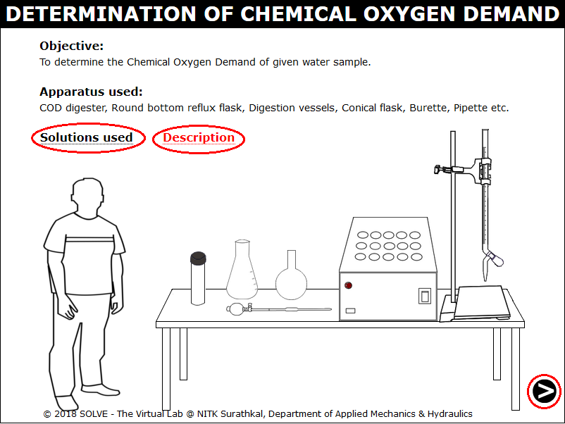 

2. Click on the graduated pipette to take 10ml of distilled water in a round bottom reflux flask. 
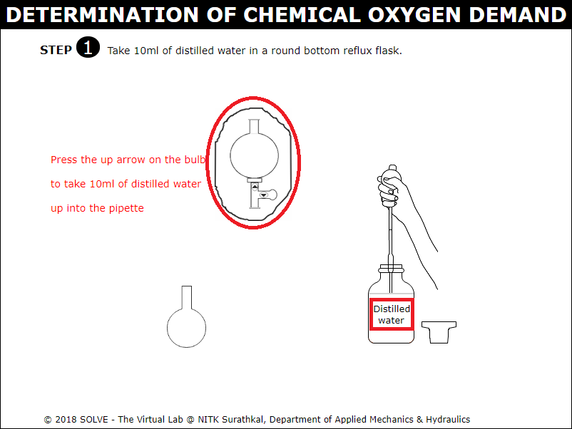 

3. Answer the question by clicking on the correct answer to proceed with the simulation. 
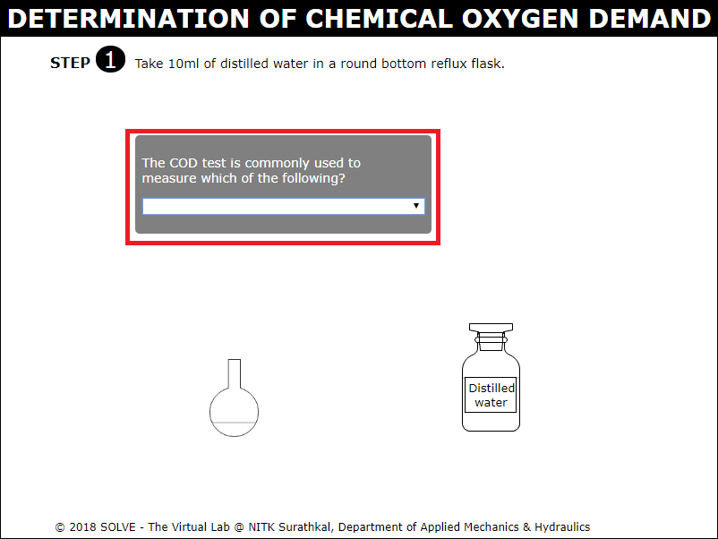 

4. Click on the graduated pipette to take 1ml of Mercury Sulphate solution in a round bottom reflux flask. 
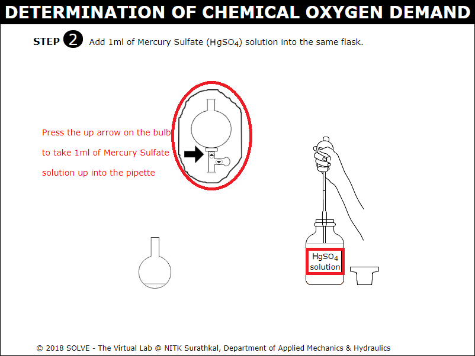 

5. Click on the graduated pipette to take 5ml of Potassium Dichromate solution in a round bottom reflux flask. 
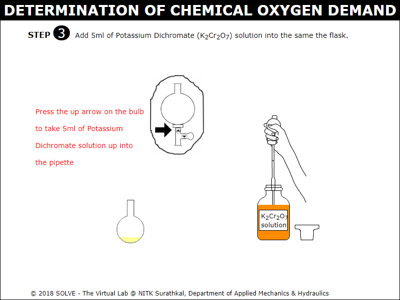 

6. Click on the graduated pipette to take 15ml of Silver Sulphate-Sulfuric Acid solution in a round bottom reflux flask. 
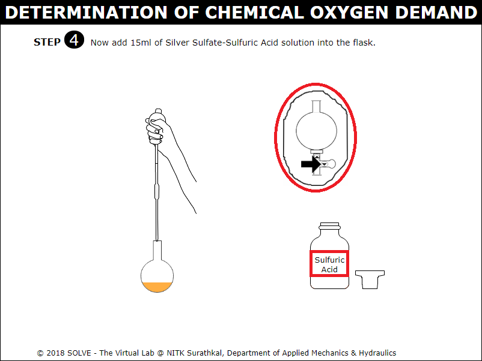 

7. Click on the round bottom reflux flask to transfer the solution to digestion vessel. Then place the digestion vessel in the COD digester. 
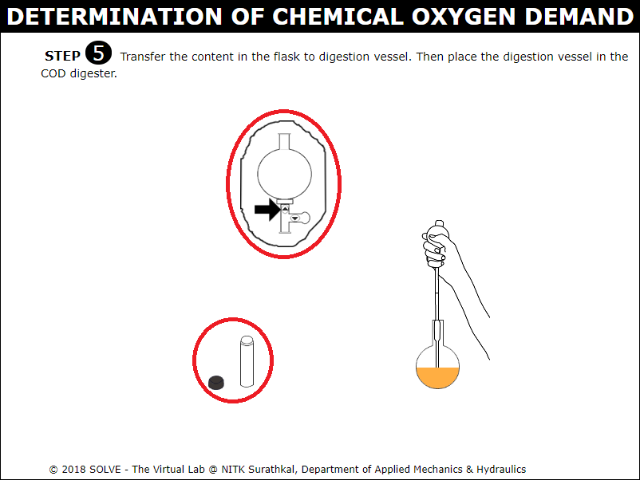 

8. Go through the instructions given and click on OK to proceed with the simulation. 
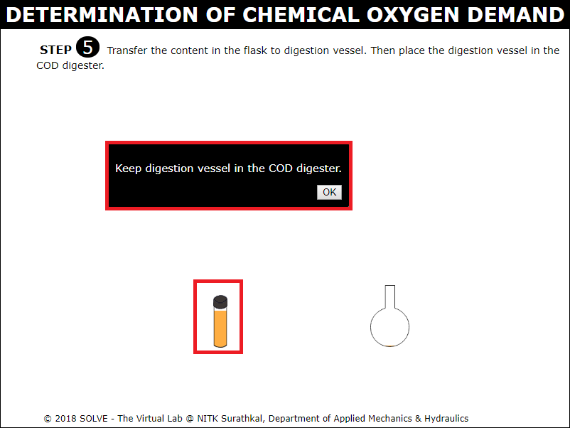 

9. After 2 hours, click on digestion vessel to remove it from the COD digester. 
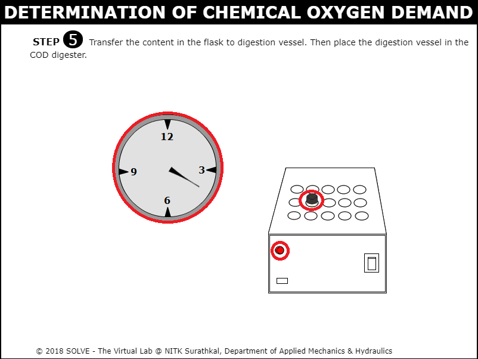 

10. Transfer the contents in the digestion vessel to conical flask. Then click on the dropper to add 2-4 drops of Ferroin indicator to the flask. 
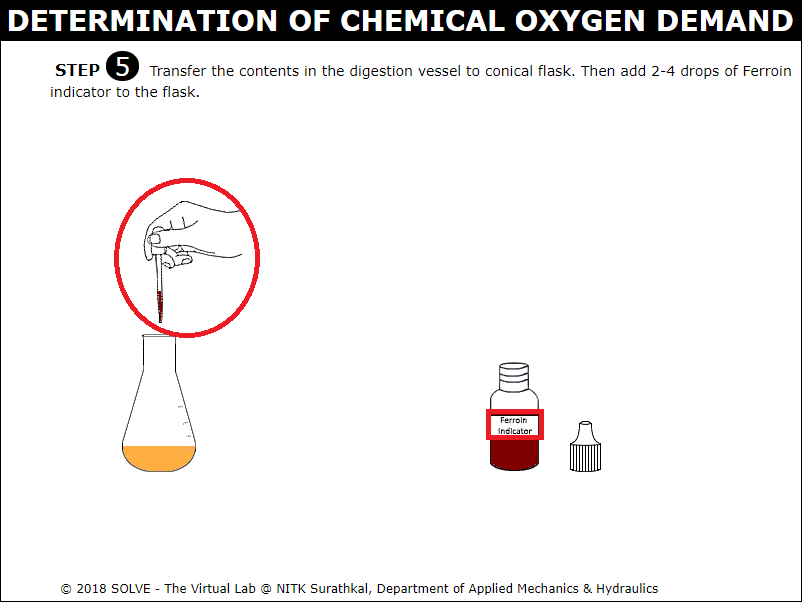 

11. Click on Ferrous Ammonium Sulphate solution to fill the solution in the burette. 
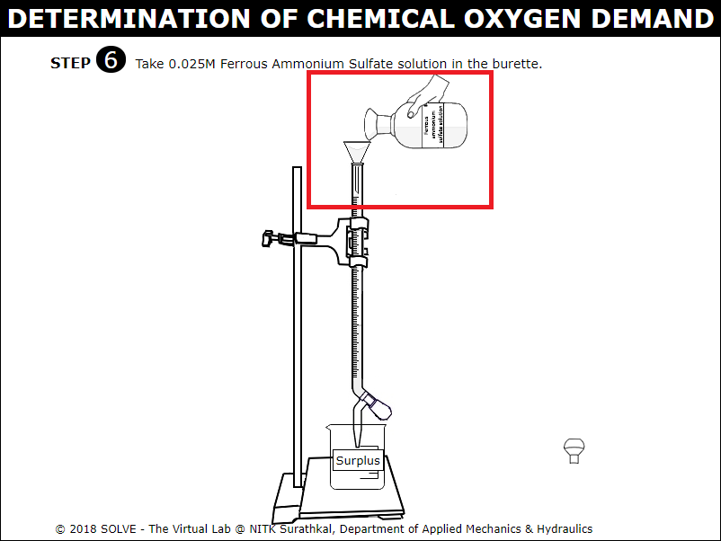 

12. Click on the knob to release and start titrating the blank solution till the colour change from blue to colourless, continue the same procedure for water sample. 
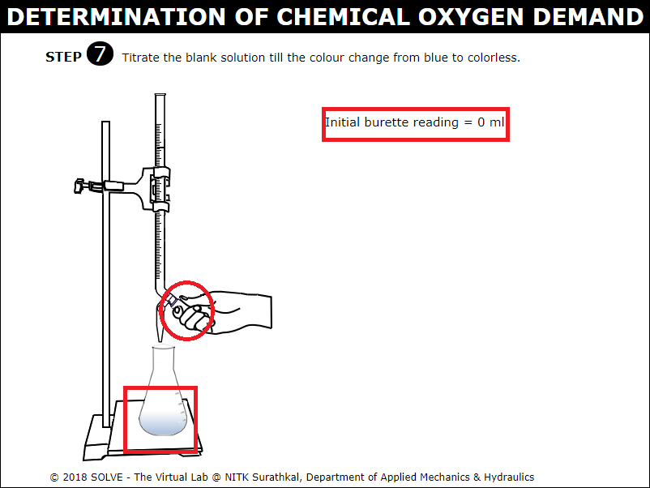 

13. Note down the initial and final burette reading and calculate the COD of the given water sample. 
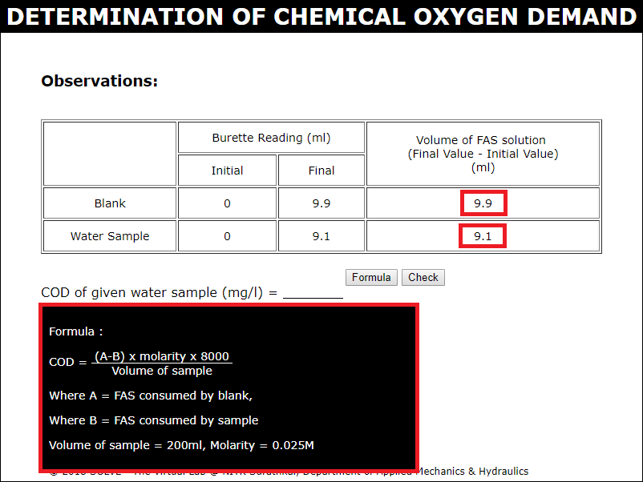 

14. Go through the Inference drawn from the obtained result. 
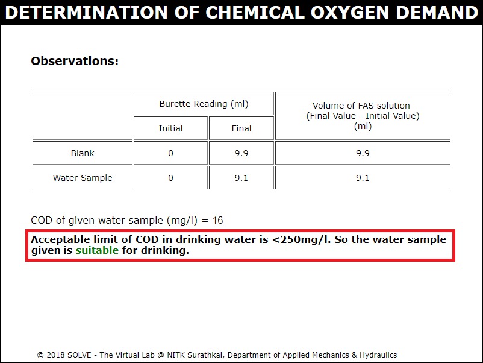 
